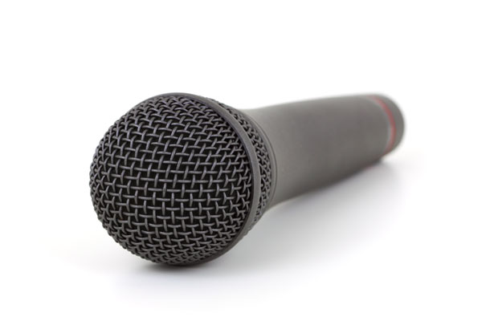
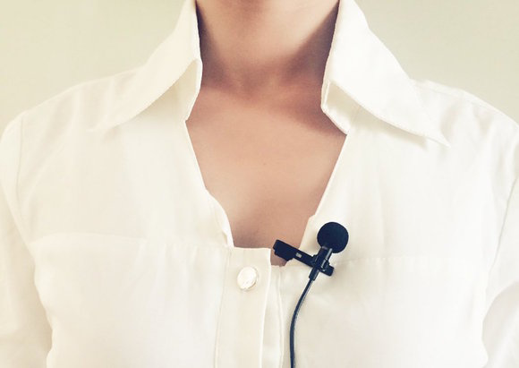

# How to have great inclusive audio at your event

It’s unfortunately easy to provide microphones that will prevent your speakers from relaxing and giving their best. The good news is: it’s also easy to get the best out of every speaker.

Mindset: the goal is to have each speaker wear what they want, look however they want, and for the audio to “just work”. As with everything that “just works”, there’s a lot of actual work to be done to make this happen. That work is yours, event organiser. This document shows you how to do it well, so comfortable and audible speakers make your event a huge success.

Do not think: this is a distraction, the speaker should just work with the soundgear I’ve got. You disrespect your speakers (especially women and nonbinary, for whom clothing, hair, and jewelry can interfere with some microphones), you’ll get the worst from them, and you are placing the responsibility for success on your speakers but denying them the ability to be successful. In short, this is the kind of thinking that makes for a crappy event and speaker experience. (Speakers talk, and word of a poor experience gets around)

> *TL;DR: provide an over-the-ear, lavalier, and handheld options at minimum. Give speakers the options and let them make a choice well before their talk. Have friendly staff and a private area to mic up. Ideally have more than just men in your AV team.*

This was compiled by Nat Torkington <nathan@torkington.com>, from the contributions of many wonderful people on Twitter. Thanks to Mike Forbes for proofreading and sanity-checking. Released at https://github.com/njt/event-audio under Creative Commons Attribution (CC-BY 4.0). Please use and improve, and let me know if you make it better. Thanks!

## Mic Options
(Mic = microphone) First, let’s review your options. There are four main ways (and a couple of other options) to pick up the speech of a speaker.

### Podium
This is a fixed mic, usually attached onto a lectern. Lecterns are trouble for many people because they’re a fixed height, but people are not. Some speakers will only appear to be eyebrows peeking over the top of the lectern, while others will loom like giants. Podium mics are usually flexible, but only to a point. They don't work at all for speakers who like to pace, and audience members between the podium and screen generally get annoyed with being unable to see.
### Handheld
Now the speaker can roam. However, many speakers (especially those who are not professional speakers) do not know how to use a handheld mic. They hold it away from their face, or instinctively relax their holding arm mid-sentence resulting in “Great speech that fades away halfway through the sentence.”  The best advice I’ve heard is: “it’s an ice cream — put it in your face”, but many people can’t relax while they’re holding the mic. And, of course, if you have a clicker, now their hands are full and gesturing is hard. These should always be wireless, with batteries in the body of the mic (so no external battery pack required).
### Lavalier (Lapel)
These are small mics that clip onto the lapel or collar of a shirt, with the wire running inside the shirt. Not everyone wears shirts with affordances for these, and many dresses are incompatible with lavaliers. These are wireless and have a battery pack which must be clipped on, yet not every item of clothing has a place that can be clipped (see below for solutions). Speakers who gesture a lot or who move their upper body can generate a lot of rustling. Long hair can be challenging, especially with poor quality lavalier mics.
### Over-the-Ear (Madonna)
These attach over the ear, and have a small boom that extends with a small mic to go near the mouth, with a wire running down the back of the speaker (either inside or outside clothing). They provide great sound quality, and provided they are attached correctly work great for people who move their heads a lot. Earrings and hair that falls over the front of the face can interfere with the mic. As with lavaliers, they come with a battery pack which must be clipped on, and not every outfit has a place that can be clipped (see below for solutions). Most over-the-ear mics work fine with long hair, although dreadlocks can be challenging. Earrings that dangle or move below the earlobe are usually fine so long as the wire is pulled away towards the back - but especially long or wide earrings can be an issue. Good quality over-the-ear mics generally provide the most consistent audio with the least amount of unwanted noise.
### Boom
Here you have a professional sound person operating a mic that’s on a long stick. The stick goes over the head of the speaker, which is out of camera shot in professional recordings, but is visible to live audiences, and captures the speaker’s words from above. This is expensive, and I have no experience with it.
### Shotgun
Here you have a microphone (usually operated by a sound person) at the front of the stage, pointing directly at the speaker's face. Not recommended for any practical purpose, included here for complete-ness only. Don't bother with this option.
## Battery Packs
Some clothing doesn’t have an option for a battery pack to clip onto. You can make (or buy) elastic armbands that hold the battery pack, like a sporty iPod strap. Similarly, an elastic waistband or moneybelts can give something to clip onto or keep the unit inside. Arm bands don’t look good on everyone (women with large figures or non-binary folks may opt out of the look of the arm band).

Wires connect the mic (lavalier or over-the-ear) to the battery pack, and these wires are generally run inside the outer layer of clothing so as not to be distracting. Consequently, there can be some faffing around under shirts, blouses, dresses, etc. Do not make people do this in public.

Surgical tape is very useful for keeping an over-the-ear mic near the mouth. You must ask first whether the speaker is allergic to surgical tape.

Check the batteries before you start, and in every break (i.e., every two hours or so). Most good quality wireless mics will last at least 6 hours, but it always pays to check. Have plenty of spare batteries handy.
## What to do
There is no one solution that works for everyone and every outfit, so provide options. The smallest set that will have something for everyone (roughly speaking, best-to-worst options):
1. Wireless over-the-ear. If hair or earrings or other concerns rule this out, use:
1. Wireless Lavalier. If hair or lack of lapels rules this out, use:
1. Wireless Handheld. If all options fail, or the presenter prefers to be static, use:
1. Lecturn / podium with fixed-position mic
1. Supply armband and waist strap options for battery packs.

Mic up your speakers backstage for their privacy.
 
If you have A/V staff assisting, try to have at least one woman. All must be positive: “let’s get you a mic that works for you” not “your hair is in the way” or "we have to clip this to your underwear because you're not wearing a belt". **Always** ask permission before adjusting anything, and make sure you tell the presenter what you're doing before you do it.

Tell speakers well ahead of time what options there are. They may choose clothing or jewelry to enable their preferred microphone option (you can also gently suggest that people forego dangly earrings if they want to use the over-the-ear mic). Don’t make them choose from the options just as they’re about to go on: generally all their attention is on their presentation and not vomiting from nerves.

If you can have an A/V walkthrough well before they are to present, do it. It reassures speakers to know that their slides will show up correctly, and you can discover any incompatibilities between clothing, hair, jewelry, and microphone. 

Most conferences send information to speakers ahead of the event so they can prepae. Here's some sample comms to speakers on microphone options (you should also include info on the presentation setup e.g. aspect ratio for slides, but that's out of scope for this):

> Hi! We’re looking forward to your presentation at our event.
>
> Just to let you know, we have three microphone options for you. (1) A wireless over-the-ear microphone, like the rockstars use. (2) A wireless lapel mic, which clips onto a collar or lapel. (3) A wireless handheld mic. The rockstar and lapel microphones have a battery pack attached by wires — the wires have to be threaded through clothing, and the battery pack clips onto a belt or bra strap or the top of a dress. Rockstar microphones can be troublesome with dangly earrings, and lapel microphones can be a problem with long hair.
>
> 
> Over-the-ear
>
> 
> Wireless handheld.
>
> 
> Lapel mic
>
> You should have a think about which mic you want to use, and plan accordingly. Show up to the green room (enter via the side corridor) 20 minutes before you’re due to go on, and we’ll get you wired up.

# Gotchas
* Thinking all speakers are the same. Comfort depends upon hair, jewelry, fashion, and preference, so what works for one will not work for all.
* Flat batteries in battery packs or handheld mics.
* Surprising speakers with only one mic style.
* Wiring speakers up in public.
* Fixed-height podiums (some presenters don't mind standing on a small platform/box to raise them up - but don't force this on anyone).
* Making any physical contact with a presenter that you haven't discussed first. AV techs often have to reach into intimate places (e.g. inside shirts, attaching beltpacks to bra straps etc.) which can make presenters uncomfortable at best. 
* Putting surgical tape on someone who is allergic.
* Making speakers sit. If speakers will sit down, e.g. in a panel, put them behind a desk that is entirely covered at the front (e.g. with a table skirt). Short skirts are not compatible with sitting.

# Experiences to Consider
These are from [this Twitter thread](https://twitter.com/gnat/status/1106003082914127872). These are the experiences of professional public speaking women, who have had a lot of good and bad microphone experiences.
* handheld is not great because then both hands are full (clicker)
* I hate handhelds
* Just good to know what the set up is so you can plan for it. I don’t mind lapel but have had many awkward hands down and up tops situations. Over ear is good as long as it’s fitted well.
* I am a big fan of the lapel mike.  I try to remember to wear trousers on those days.  I am also fine with having the sound guy (100% guys so far) rummage for my bra strap when I forget.
* I can deal with lapel mics in almost all my public speaking outfits, but big battery packs are the killer. don't think I've ever had a set up that worked notably well.
* So everything comes with issues - lapel mic *can* work on some necklines; over the ear mics *can* work if you can keep hair & earrings off; wireless handheld mic is ok if you’re not a big gesticulator & is great if you don’t have a belt line/pocket.
* The truth is, I’ve adapted what I wear to speak in public to the mics I’m most likely to encounter. I have a public speaking blazer, with a pocket *and* a lapel.
* Classic Britney look of pimple mike + arm strap
* I'm not a fan of hand mics as it feels a bit karaoke (plus I gesture). Lapel mic is preferred. I use a belt with my dresses (though have been marked down in speaker feedback for it). Normally have a tiny cross body purse with me too just in case. Madonna mics don't stay on me
* I've preferred over ear ones - but the most important thing this is knowing what it will be in advance. Then I can plan my outfit (with pockets) / jewellery / hairstyle around whatever cons that particular set up has to offer. The more prep time the better.
* Yes, this. Also general information about the seating/standing setup is useful for outfit planning too.
* I always go with huge pockets, which is usually dresses. Sometimes there’s some mild complaining about lack of lapel, but I speak so loudly usually it’s not an actual problem if it’s not centered
* Mics on a podium can work in some cases! Though for walk around there isn’t really a great option unless you wear pants.
* Personally I love a handheld mic (also because it stops me from waving my arms around because I'm a really, uh, expressive speaker)
* Madonna mic is the one I prefer to give speakers, as it works better with them as they move around the stage, turn their head and gives better clarity of sound.
* Battery pack with clip can go in the back of the shirt or dress at neck level, that works quite well.
* After a few years I have learned:
** wear dresses with pockets or a sturdy belt so the battery pack can be attached
** avoid wearing dangly earrings (having AV people loop over-ear mics through them looks and feels awkward)
** try to wear necklaces that don't get in the way
* This requires advance planning but now I have a selection of conference-speaking outfits that work for most non-handheld mics. I never want someone to clip a battery pack to my bra strap again.
* This isn't about what mic to purchase, sorry. I hate handhelds, and there doesn't seem to be a good option that lets me wear whatever I want and have both hands free when talking.
* What I *really* like is a mic on a podium. But I'm not really a walk-around kind of speaker. I am a pretty hand-gesture-y speaker, though, so having my hands free is important.
* Handheld. I always forget abt the mic and wear a dress
* This is what blazers are for. Otherwise,  handheld. And yes, I've pointedly joked about the other style assuming men's clothing and me having to make choices.
* to reiterate a point others have made: *advance notice* is the key. Most experienced public speakers will have outfits that work with all the options, but it *is* possible to forget, even when you're experienced! I personally prefer over-the-ear.
* I've always just used whatever set up happens to be at the venue. I prefer mic stand or lapel set ups & I tend to wear skirt or trousers so there's a waist band to clip battery packs to. I haven't encountered any packs that have been heavy enough to require anything sturdier.
* I prefer a headset mic for wardrobe flexibility. If it's a lav, I'll wear a t-shirt to have somewhere to fasten it. I don't want to dual-wield a handheld and a remote, so I try to avoid that. Podium mics aren't great. I always wear a skirt with a rear pocket for the battery pack.
* P.S. did you know you can not look like a space alien with the antenna poking out of your hair by having the tech turn the retaining clip upside down so the antenna points down instead if it's clipped to the back of your dress?
* If you are going to use a madonna or a lav mic, have some plain belts (in small and plus sizes) on hand to modify outfits.
* I like the over-ear ones, for the freedom to gesticulate. But I also wear a bolo-esque leather necklace (good for lavaliers) and low-profile MUJI hip bag every day (pocketsssss!!).
* My ranked preference: hand held mike, then clip-on with battery pack (WITH a heads up so I know to wear something to accommodate it!), then the behind the ear loop style, then fixed at the podium. I’m short, fixed mikes are hard to stay in range of.
* Also knowing in advance what kind of mike options are available help us plan outfits that won’t force you to undress in front of an AV person
* Forewarned re options is absolutely the best. I’m usually wearing a silk dress, but can adapt if I have to wear lapel mic & battery pack. It can involve undergarments, so yeah...
